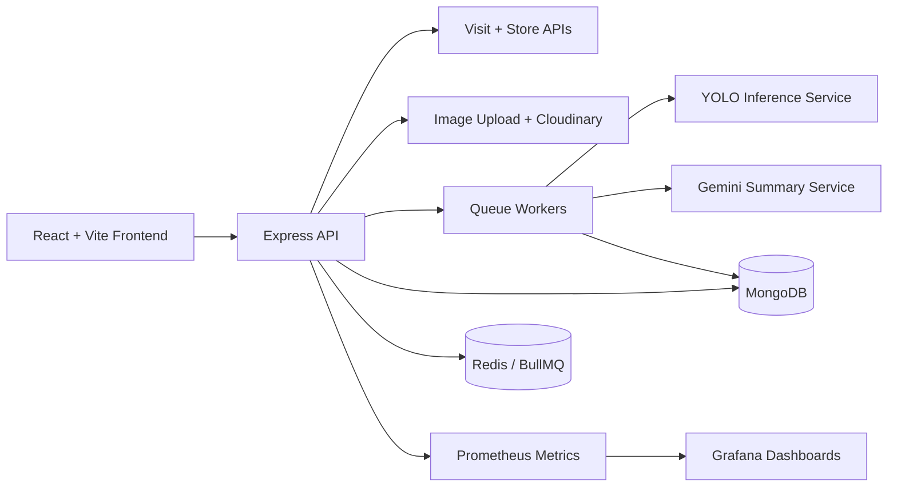
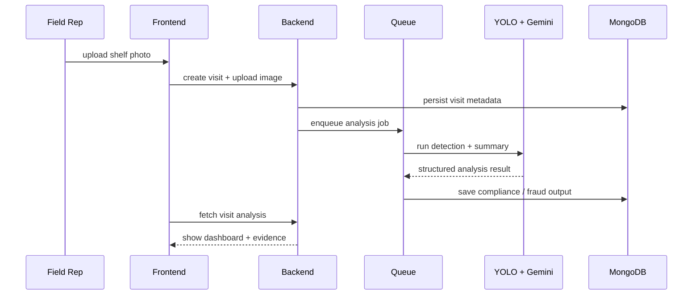

# RetailOS Rapid Build Sprint

A compact AI-native retail execution platform built in a 72-hour sprint.

RetailOS simulates the daily workflow of a field sales representative visiting outlets, uploading shelf photos, triggering AI shelf analysis, detecting fraud signals, and giving supervisors an operational dashboard to review compliance and execution quality.

## What makes it interesting

- end-to-end business workflow instead of an isolated AI demo
- image ingestion, queueing, AI analysis, and dashboard review in one system
- fraud-aware retail execution flow
- observability with Prometheus and Grafana
- backend, frontend, AI, and ops all represented in a single sprint project

## Core workflow

1. Rep checks in to a store.
2. Rep uploads shelf evidence.
3. Backend stores media and schedules analysis.
4. YOLO-compatible inference detects products and shelf state.
5. Gemini produces supervisor-ready summaries.
6. Dashboards surface compliance, issues, fraud, and job status.

## Architecture overview



## Frontend pages

```text
client/retail-os/src/pages/
├── ShopDashboardPage.tsx
├── SingleShopPage.tsx
├── VisitPage.tsx
├── AiAnalysisPage.tsx
├── ImageHistoryPage.tsx
├── VisitFeedPage.tsx
├── AdminVisitsPage.tsx
├── AdminFraudPage.tsx
├── AdminJobsPage.tsx
└── AdminAssistantPage.tsx
```

## Example visit lifecycle



## Quick start

### Backend

```bash
cd server
npm install
docker compose up -d mongo redis prometheus grafana
npm run dev
```

### Frontend

```bash
cd client/retail-os
npm install
npm run dev
```

## Useful local URLs

- Frontend: `http://localhost:5173`
- Backend: `http://localhost:5000`
- Health: `http://localhost:5000/health`
- Metrics: `http://localhost:5000/metrics`
- Grafana: `http://localhost:3001`
- Prometheus: `http://localhost:9090`

## Key backend subsystems

- auth and admin workflows
- store and visit management
- image pipeline
- Gemini summary generation
- YOLO integration
- BullMQ jobs
- metrics and dashboards

## Tech stack

- React + TypeScript + Vite
- Express + TypeScript
- MongoDB
- Redis + BullMQ
- Cloudinary
- Gemini
- Prometheus + Grafana

## Why this project is portfolio-relevant

RetailOS is a strong sprint artifact because it proves you can connect product workflow, AI services, async processing, and ops visibility under deadline pressure.
